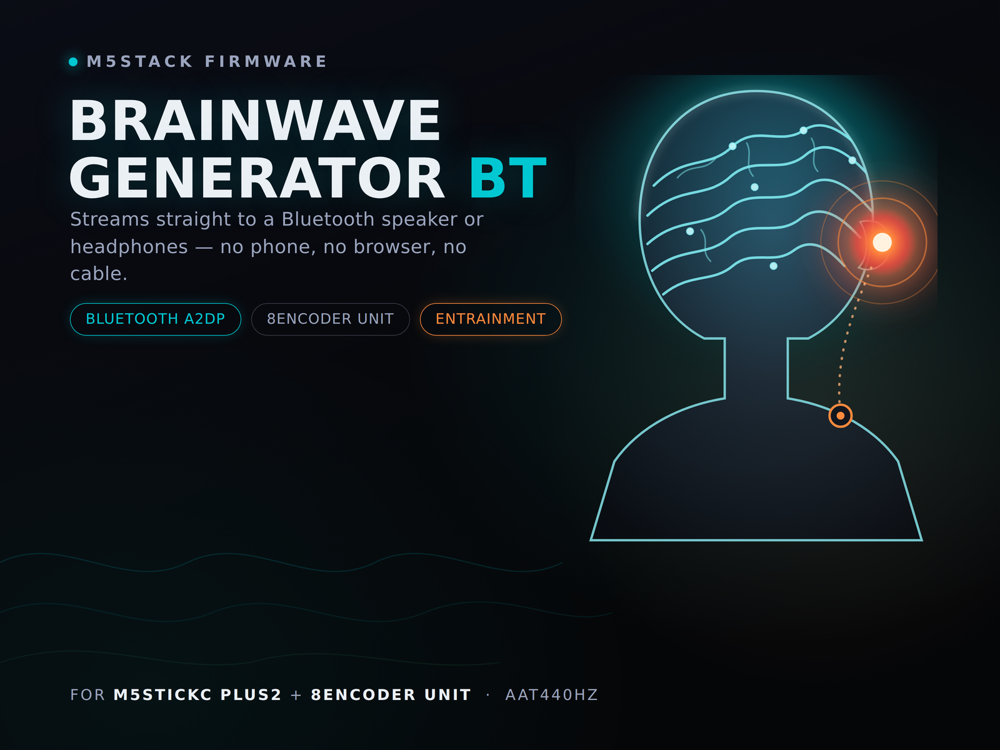

# Brainwave Generator BT

**Dual-tone isochronic pulse generator for the M5StickC PLUS2 + 8Encoder Unit — streamed straight to a Bluetooth speaker or headphones. No phone, no browser, no cable.**

This is a from-scratch Bluetooth rebuild of an earlier WiFi/webpage-based brainwave generator. Instead of connecting to a web UI over WiFi, the M5StickC PLUS2 pairs directly with a Bluetooth speaker or headphones over classic Bluetooth A2DP and synthesizes the audio on-device in real time. Two knob-controlled sine tones are mixed together and amplitude-modulated by a third "pulse" oscillator, producing an isochronic-style pulsing tone — the same math the original web version used.

## Features

- **No phone or browser required.** Pairs directly to a Bluetooth speaker/headphones and generates audio on-device.
- **8 physical knobs**, one per parameter — no menus to dig through mid-session.
- **Speaker memory.** Remembers the last speaker it connected to (saved to flash) and reconnects automatically on boot.
- **Reliable reconnect.** Uses a direct Bluetooth page/connect to the known device rather than an inquiry scan, so it reconnects even after the physical power button is used (no graceful shutdown hook available on that path).
- **Stable, glitch-free audio.** A precomputed sine lookup table keeps the audio callback fast enough to avoid skipping or watchdog reboots, and the source volume is explicitly forced to max on every connection so playback level is consistent whether you just paired or auto-reconnected.
- **"Alien" pitch/pulse drift.** Every few seconds each tone gets a small random re-roll on top of whatever the knobs are set to, for a subtly shifting, less mechanical character.
- **On-screen battery percentage**, color-coded by charge level.
- **Clean instrument-panel UI**, flicker-free (drawn to an off-screen sprite and pushed to the display in one shot).

## Hardware

- [M5StickC PLUS2](https://docs.m5stack.com/en/core/M5StickC%20PLUS2)
- [M5Stack 8Encoder Unit](https://docs.m5stack.com/en/unit/8Encoder)
- A Bluetooth A2DP speaker or headphones (classic Bluetooth, not BLE-only)

### Wiring

The 8Encoder Unit connects over I2C using the M5StickC PLUS2's Grove port:

| M5StickC PLUS2 | 8Encoder Unit |
|---|---|
| GPIO32 (SDA) | SDA |
| GPIO33 (SCL) | SCL |
| 5V | 5V |
| GND | GND |

A Grove cable handles all four automatically — no manual wiring needed if you're using the stock cable.

## Installation

1. Install the [M5StickCPlus2 board support / library](https://github.com/m5stack/M5StickCPlus2) via the Arduino Library Manager (or PlatformIO).
2. Install the following libraries via the Arduino Library Manager:
   - **M5StickCPlus2** (m5stack)
   - **UNIT_8ENCODER** (m5stack)
   - **ESP32-A2DP** by Phil Schatzmann — [github.com/pschatzmann/ESP32-A2DP](https://github.com/pschatzmann/ESP32-A2DP)
3. Open `8EncoderUnit-BrainWaveGenerator-Bluetooth-M5StickCPlus2.ino` in the Arduino IDE.
4. Select **M5StickCPlus2** as the board, pick the correct serial port, and upload.

Alternatively, flash a prebuilt binary directly from [M5Burner](https://docs.m5stack.com/en/uiflow/m5burner/intro) — search for **Brainwave Generator BT** under `aat440hz`.

## Usage

### First boot / picking a speaker

On first boot (or if no speaker is remembered yet), the device scans for nearby Bluetooth speakers/receivers:

- **BtnB** (side button) — move the cursor to the next discovered device.
- **BtnA** (front button) — connect to the highlighted device.

On every later boot, it automatically reconnects to the last speaker you used (up to ~25s). Press **BtnB** at any point during that reconnect attempt to skip straight to the picker instead.

### Running

Once connected, the 8 encoder knobs control the tone:

| Channel | Controls |
|---|---|
| 0 | Frequency 1 — base |
| 1 | Frequency 1 — fine tune |
| 2 | Frequency 1 — multiplier |
| 4 | Frequency 2 — base |
| 5 | Frequency 2 — fine tune |
| 6 | Frequency 2 — multiplier |
| 3 | Pulse rate — base |
| 7 | Pulse rate — fine tune |

- **BtnA** — start/stop playback.
- **Hold BtnB for ~1.5s** — disconnect, forget the current speaker, and restart into the picker (use this to switch speakers).

The screen shows Freq 1, Freq 2, and Pulse rate live, plus a color-coded playing/stopped status bar with the connected speaker's name, and the battery percentage in the header of every screen.

## How it works (technical notes)

- **Synthesis:** two sine oscillators are mixed and their combined amplitude is modulated by a third, slower sine LFO (the "pulse"), the same approach the original web-based version used. Audio is generated sample-by-sample in the A2DP data callback using a precomputed 1024-entry sine lookup table rather than calling `sin()`/`sinf()` per sample — the ESP32 has no hardware double-precision FPU, and per-sample trig calls at 44.1kHz aren't fast enough to keep up with real time without causing audio skips or tripping the watchdog timer.
- **Drift:** every 5 seconds, each tone gets a fresh random offset layered on top of the knob-set values (an abrupt re-roll, not a glide), plus a smaller wobble on the pulse rate. Only the audio hears this — the on-screen numbers always show the clean, knob-set base values.
- **Reconnect:** the last-connected speaker's address is saved to flash (NVS) and paged directly on boot rather than rediscovered via an inquiry scan — most speakers stop responding to inquiry scans once they're out of pairing mode, but still accept a direct connection from a device they already know.
- **Volume consistency:** the ESP32-A2DP library syncs its output gain to whatever volume the speaker reports over AVRCP, which can differ between a fresh pairing and a reconnect. This sketch forces the gain to maximum immediately on connect and re-asserts it for a few seconds afterward so playback level is identical either way.

## Troubleshooting

- **No connection confirmation chime on some speakers (e.g. JBL Go):** expected. This sketch implements A2DP source only, not the AVRCP transport-control handshake some speakers use to trigger that chime — audio still connects and plays normally.
- **A knob's steps feel too coarse or too fine:** adjust `MULTIPLIER_STEP` (for the multiplier knobs) or `ENCODER_COUNTS_PER_CLICK` (if your 8Encoder unit reports more than one raw count per physical detent) near the top of the sketch.
- **Won't reconnect to a speaker at all:** hold BtnB for ~1.5s while running to forget it, then pair fresh from the picker.

## Credits

Built by [aat440hz](https://github.com/aat440hz). Bluetooth audio via [ESP32-A2DP](https://github.com/pschatzmann/ESP32-A2DP) by Phil Schatzmann.
